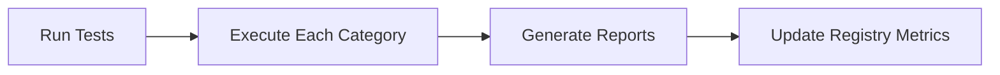

# Agent Creation System Architecture

## Overview

Research-backed agent creation system following Anthropic 2025 best practices for building production-ready OpenCode agents.

## Core Principles

Based on Anthropic's multi-agent research (Sept-Dec 2025):

1. **Minimal Prompts (~500 tokens)**: "Find the smallest possible set of high-signal tokens"
2. **Single Agent + Tools**: NOT multi-agent for coding (code changes are sequential)
3. **Just-in-Time Context**: Tools load context on demand, not pre-loaded
4. **Clear Tool Definitions**: Purpose, when to use, when NOT to use
5. **Outcome-Focused Evaluation**: Token usage explains 80% of performance variance

## Directory Structure

```
.opencode/
├── agent/
│   ├── core/                    # Essential navigation/analysis agents
│   │   ├── codebase-analyzer.md
│   │   ├── codebase-locator.md
│   │   ├── codebase-pattern-finder.md
│   │   ├── thoughts-analyzer.md
│   │   ├── thoughts-locator.md
│   │   └── web-search-researcher.md
│   ├── development/             # Development task agents
│   └── content/                 # Documentation/content agents
├── command/
│   ├── create-agent.md          # Agent creation command
│   ├── create-tests.md          # Test suite generation
│   ├── execute.md
│   ├── plan.md
│   ├── research.md
│   ├── ticket.md
│   ├── commit.md
│   └── review.md
├── templates/
│   ├── agent-minimal.md         # ~500 token agent template
│   ├── agent-full.md            # Extended template with tools table
│   └── context-project.md       # CLAUDE.md pattern template
├── registry.json                # Central agent registry
└── registry.schema.json         # JSON Schema for registry

evals/
├── framework/
│   ├── config.yaml              # Global eval settings
│   └── test-schema.yaml         # Test definition schema
├── templates/                   # 8 test category templates
│   ├── planning/
│   ├── context-loading/
│   ├── implementation/
│   ├── tool-usage/
│   ├── error-handling/
│   ├── extended-thinking/
│   ├── compaction/
│   └── completion/
├── runner/                      # TypeScript eval runner
│   ├── index.ts                 # CLI entry point
│   ├── executor.ts              # Test execution logic
│   ├── reporter.ts              # JSON/Markdown report generation
│   ├── types.ts                 # TypeScript interfaces
│   └── update-metrics.ts        # Registry metrics updater
├── reports/                     # Generated eval reports
│   └── {agent}-{timestamp}.{json,md}
└── agents/                      # Per-agent test suites
    └── {agent-name}/
        ├── config/
        │   └── config.yaml      # Agent-specific eval config
        └── tests/
            └── {category}/      # 8 test categories
                └── *.yaml       # Individual test cases
```

## Agent File Format

Minimal template (~500 tokens):

```markdown
---
description: "{one-line purpose}"
mode: subagent
model: sonic-fast
temperature: 0.1
tools:
  read: true/false
  ...
---

# {Agent Name}

{1-2 sentence role description}

## Approach
1-4 numbered steps

## Heuristics
3-4 key decision rules

## Output
What to always include

## Example
One canonical request/response
```

## Registry Schema

Each agent entry includes:
- `file`: Path to agent markdown
- `category`: core | development | content
- `status`: draft | experimental | stable | legacy | deprecated
- `description`: One-line description
- `version`: Semver version
- `tools`: Array of allowed tools
- `testSuite`: Path to eval directory
- `metrics`: avgTokens, successRate

## 8 Essential Test Categories

| Category | Purpose |
|----------|---------|
| Planning | Verify plan-first approach |
| Context Loading | Ensure just-in-time retrieval |
| Implementation | Verify incremental execution |
| Tool Usage | Check correct tool selection |
| Error Handling | Verify stop-on-failure |
| Extended Thinking | Check decomposition |
| Compaction | Verify summarization |
| Completion | Check proper handoff |

## Commands

### `/create-agent {name}`
Interactive agent creation:
1. Gather requirements (name, purpose, tools)
2. Define behavior (approach, heuristics, output)
3. Generate agent file from template
4. Update registry
5. Optionally create project context
6. Offer test suite generation

### `/create-tests {agent-name}`
Generate 8-test evaluation suite:
1. Load agent definition
2. Create test directory structure
3. Generate agent-specific config
4. Create tests from templates
5. Update registry with testSuite path

## Eval Runner

The TypeScript eval runner executes test suites and generates reports.

### Usage

```bash
# Show help
bun run evals/runner/index.ts --help

# Run all tests for an agent
bun run evals/runner/index.ts --agent=codebase-locator

# Run specific category with verbose output
bun run evals/runner/index.ts --agent=codebase-locator --category=planning --verbose

# Custom output directory
bun run evals/runner/index.ts --agent=codebase-locator --output=./my-reports
```

### Options

| Flag | Short | Description |
|------|-------|-------------|
| `--agent` | `-a` | Agent to test (required) |
| `--category` | `-c` | Run only specific category |
| `--verbose` | `-v` | Show detailed output |
| `--output` | `-o` | Report output directory |
| `--help` | `-h` | Show help |

### Output

The runner generates:
- **JSON report**: Machine-readable results with metrics
- **Markdown report**: Human-readable summary with tables
- **Registry update**: Automatically updates agent metrics in `registry.json`

### Workflow



## Migration Path

Legacy agents have been removed. All agents now reside in `agent/{category}/*.md`.

## Implementation Status

| Component | Status |
|-----------|--------|
| Registry + Schema | Complete |
| Agent Templates | Complete |
| `/create-agent` command | Complete |
| `/create-tests` command | Complete |
| Eval Framework | Complete |
| Eval Runner | Complete |
| Test Suites (2 agents) | Complete |
| Metrics Integration | Complete |

## Research References

- Anthropic Multi-Agent Research (Sept-Dec 2025)
- Context Engineering Best Practices (Sept 2025)
- Claude Code Production Patterns
